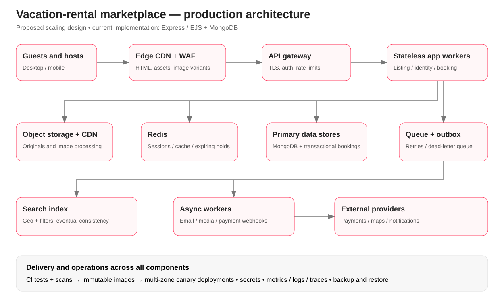

# Production architecture proposal

This diagram is a proposed production design. The delivered app is an Express/EJS monolith with MongoDB, Mongo-backed sessions, Cloudinary images and optional Mapbox/OAuth/email integrations.

## Scaling decisions

- **Frontend:** serve versioned CSS, JavaScript, fonts and responsive images through a CDN. Render public listing pages on stateless web workers with short-lived caching; keep personalised and booking responses private.
- **Backend:** an API gateway applies rate limits, authentication and routing. Horizontally scaled services own identity, listings, search, bookings and messaging. Start as modules in one service and split only when traffic or ownership warrants it.
- **Storage:** object storage holds originals and generated image sizes. The relational booking store uses transactions, unique inventory constraints, time-limited holds and idempotency keys. Partition by region/listing only when required. Listing/profile data can remain in MongoDB with replicas and indexes. Store sessions and transient caches in Redis, with bounded TTLs.
- **Search:** publish listing changes through an outbox and event queue into a geospatial search index. Search is eventually consistent; always revalidate price and availability against the booking authority before confirming.
- **Payments and notifications:** payment webhooks are authenticated and idempotent; a worker finalises booking state and queues confirmations. Retries, a dead-letter queue and reconciliation jobs handle external failures. Never place a payment side effect inside a browser-only flow.
- **Deployment:** CI checks lint/types where applicable, tests, dependency/secrets scans and builds an immutable image. Deploy to multiple availability zones using rolling or canary releases, health probes and automated rollback. Expand/contract migrations keep old and new workers compatible.
- **Operations:** central logs, metrics and tracing track latency, errors, failed bookings and queue lag. Backups have tested restores and region-specific recovery objectives. Secrets live in a managed secret store. Enforce least privilege, TLS, CSRF protection and audit logging before a production launch.

## Example reservation

A guest selects dates → booking service atomically holds the inventory → payment succeeds → a verified webhook confirms the reservation → the outbox publishes a booking event → workers send the receipt and update downstream search/cache. Expired holds release inventory. Repeated requests return the original result using an idempotency key.
